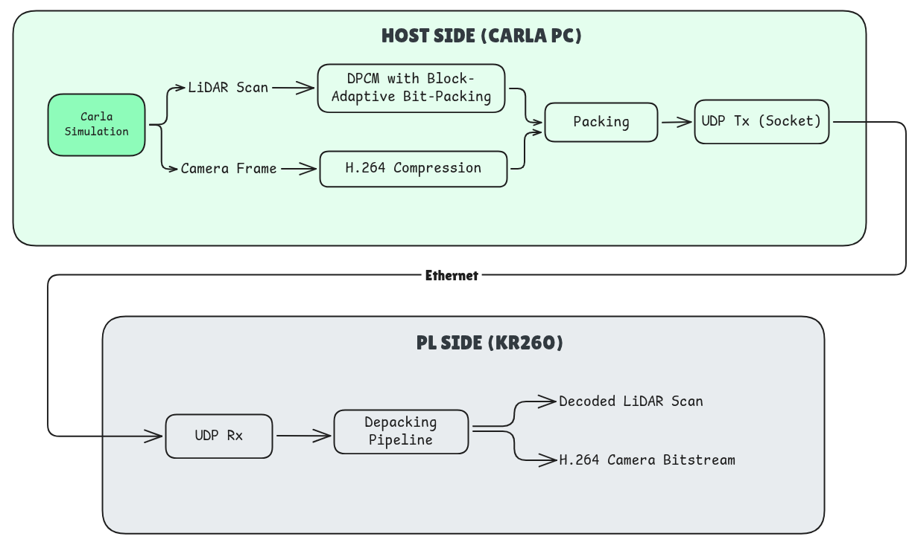
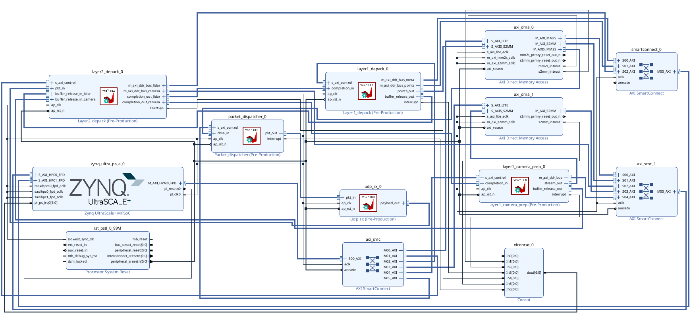

# Carla-SIL-Pynq-Kria-FPGA

Software-in-loop testing of the CARLA ADAS simulator with PYNQ running on a Kria KR260.

## Overview

CARLA runs on a host PC and generates LiDAR and camera frames as part of the simulation. This pipeline sends them over the network to a KR260 board and reconstructs them on the FPGA's programmable logic (PL).

## Repository structure

```
HLS_IP/
├── packet_dispatcher.zip       # Batch DMA transfer of UDP packets
├── udp_rx.zip                  # UDP/IP header parsing and checksum validation
├── layer2_depack.zip           # Custom protocol header parsing and fragment reassembly
├── layer1_depack.zip           # LiDAR frame metadata parsing and decompression
└── layer1_camera_prep.zip      # Camera frame metadata and compressed bitstream extraction

PYNQ/
├── golden_outputs/            # Pre-generated UDP stream and golden references for the offline testbench
├── testbench_live.ipynb       # Reference live PYNQ testbench
└── testbench_offline.ipynb    # Reference offline PYNQ testbench

python-scripts/
├── golden_outputs/            # Golden LiDAR/camera references used by the live testbench
├── testbench_input/           # Pre-recorded camera and LiDAR frames streamed by the live testbench
├── generate_tb.py             # Generates the offline testbench's UDP stream and golden references
├── layer1_camera.py           # H.264 compression & packing of camera frames
├── layer1_lidar.py            # DPCM with Block-Adaptive Bit-Packing of LiDAR point clouds
├── layer2_transport.py        # Custom protocol packing and UDP fragmentation
└── live_stream_tb.py          # End-to-end host-side streaming testbench

Vivado/
├── block_design.png                    
├── depack_pipeline_bd.tcl              # Regenerates the block design from the HLS IPs
├── depack_pipeline_block_design.pdf    # Block design reference
├── depack_pipeline.bit                 # Bitstream, load directly to run on a KR260
├── depack_pipeline.hwh                 
└── design_1_wrapper.xsa                # Hardware platform export

pipeline.png                    
```

## Table of contents

1. [Pipeline overview](#pipeline-overview)
2. [Example Vivado design](#example-vivado-design)
3. [PYNQ notebook usage](#pynq-notebook-usage)
4. [Packet format](#packet-format)
5. [IP details and interfaces](#ip-details-and-interfaces)
   - [packet_dispatcher](#packet_dispatcher)
   - [udp_rx](#udp_rx)
   - [layer2_depack](#layer2_depack)
   - [layer1_depack (LiDAR)](#layer1_depack-lidar)
   - [layer1_camera_prep](#layer1_camera_prep)

---

## Pipeline overview



**Host side (CARLA PC)**

- CARLA produces a LiDAR scan and a camera frame each simulation tick.
- LiDAR points are compressed with DPCM with Block-Adaptive Bit-Packing on distance, azimuth, and elevation. Reflectivity stays uncompressed.
- Camera frames are compressed into a plain H.264 bitstream.
- Each frame is wrapped in a custom header, split into MTU-sized fragments, and each fragment is wrapped in a standard IP/UDP packet.
- Packets are streamed out over Ethernet to the KR260.

**PL side (KR260)**

- The UDP receiver strips the IP/UDP headers, validates the checksums, and forwards the UDP payload downstream.
- The depacking stage parses the custom header, groups fragments by sensor and frame ID, and writes them into a per-sensor DDR slot. Once a frame's fragments are all in, it emits a completion descriptor.
- For LiDAR: the descriptor is used to parse the frame metadata, then the DPCM decoder reconstructs every point.
- For camera: the descriptor is used to parse the frame metadata and stream out both the descriptor and the raw H.264 bitstream from DDR. Decoding itself isn't done here (H.264 decoding is left to PS software or a separate PL decoder).

A visual reference of the block design used to wire these IPs together is in `Vivado/depack_pipeline_block_design.pdf`.

**Size limit:** each compressed frame, LiDAR or camera, must not exceed 1.4 MB (1024 fragments × 1400 bytes/fragment, the per-slot capacity).

## Example Vivado design

`Vivado/` contains a working reference design built from the IP above, plus a Tcl script to regenerate it.



- `block_design.png` 
- `depack_pipeline.bit`
- `depack_pipeline.hwh`
- `depack_pipeline_block_design.pdf` 
- `design_1_wrapper.xsa`
- `depack_pipeline_bd.tcl`

A `packet_dispatcher` IP is introduced between the AXI DMA and `udp_rx` to reduce the software overhead of Simple-mode DMA. Since Simple DMA processes one transfer at a time and asserts `TLAST` only at the end of the programmed transfer, sending packets individually would require a DMA transfer for every packet.

To improve throughput, the host batches multiple UDP packets into a single DMA buffer. The Packet Dispatcher uses each packet's IP `Total Length` field to detect packet boundaries and regenerates the appropriate `TLAST`/`TKEEP` before forwarding packets to `udp_rx`.

This reduces the DMA/software round-trip from once per packet to once per batch, enabling higher sustained throughput without Scatter-Gather DMA.

## PYNQ notebook usage

The PYNQ notebooks provide two ways to test the FPGA pipeline.

### Offline testbench

`PYNQ/testbench_offline.ipynb` sends a pre-generated UDP stream through the FPGA pipeline.

Test data is stored in `PYNQ/golden_outputs/`:

* `udp_input_interleaved.dat` — pre-generated UDP packet stream
* `golden_lidar.dat` — expected decompressed LiDAR output
* `golden_camera_*.h264` — expected compressed H.264 bitstreams

The notebook streams the UDP packets to the PL in batches of **32 packets per DMA transfer**, captures the LiDAR and camera outputs, and compares them against the golden references frame-by-frame.

### Live testbench

`PYNQ/testbench_live.ipynb` receives UDP packets from the host and streams them to the FPGA pipeline through the PYNQ DMA.

`python-scripts/live_stream_tb.py` replays pre-recorded camera and LiDAR frames over the network in real time, as if they were coming from CARLA live. It reads its input frames from `testbench_input/` and sends them individually to the KR260 over PS Ethernet.

This script runs on the host PC.

Example:

```bash
python3 live_stream_tb.py \
    --fpga-ip 192.168.1.14 \
    --fpga-port 6000 \
    --total-frames 150 \
    --fps 30 \
    --use-precompressed \
    --sensor both
```

## Packet format

Each UDP payload is one fragment of a sensor frame. Packing on the host side is implemented across three modules: `layer2_transport.py` (fragment header), `layer1_lidar.py` (LiDAR frame payload), and `layer1_camera.py` (camera frame payload).

### Layer 2 (Transport) format

| Field | Size | Notes |
|---|---|---|
| Sync word | 2 bytes | Fixed value, detects a valid header |
| Version | 1 byte | Protocol version |
| Sensor type | 1 byte | `1` = LiDAR, `2` = camera |
| Sensor ID | 1 byte | Identifies which sensor instance |
| Flags | 1 byte | bit 0 = last fragment, bit 1 = compressed |
| Frame ID | 4 bytes | Same value across all fragments of one frame |
| Total fragments | 2 bytes | Number of fragments this frame is split into |
| Fragment index | 2 bytes | 0-based index of this fragment |
| Payload length | 2 bytes | Bytes of sensor payload in this fragment |
| Payload | variable, up to `MAX_PAYLOAD` (1400 bytes) | This fragment's slice of the sensor frame payload (LiDAR or camera) |

### LiDAR frame payload

Distance, azimuth, and elevation are each DPCM (Differential Pulse Code Modulation) + zigzag encoded, then bit-packed in fixed-size blocks (`BLOCK_SIZE = 256` points) with a per-block bit width.

| Field | Size | Notes |
|---|---|---|
| Num points | 4 bytes | Number of LiDAR points in this scan (big-endian) |
| Timestamp | 8 bytes | Time this scan was captured (double, big-endian) |
| Distance: body length | 4 bytes | Size of the compressed distance data, in bytes |
| Distance: widths length | 4 bytes | Size of the distance width array, in bytes |
| Azimuth: body length | 4 bytes | Size of the compressed azimuth data, in bytes |
| Azimuth: widths length | 4 bytes | Size of the azimuth width array, in bytes |
| Elevation: body length | 4 bytes | Size of the compressed elevation data, in bytes |
| Elevation: widths length | 4 bytes | Size of the elevation width array, in bytes |
| Distance body | variable | Compressed distance values for every point |
| Distance widths | variable | Bit width used per block when compressing distance |
| Azimuth body | variable | Compressed azimuth values for every point |
| Azimuth widths | variable | Bit width used per block when compressing azimuth |
| Elevation body | variable | Compressed elevation values for every point |
| Elevation widths | variable | Bit width used per block when compressing elevation |
| Reflectivity | 1 byte per point | Reflectivity value for every point, uncompressed |

When `compress=False`, each field is instead sent as flat `uint16`/`int16` values with an empty widths array.

### Camera frame payload

**Compressed (H.264)**

| Field | Size | Notes |
|---|---|---|
| Width | 4 bytes | Frame width, in pixels |
| Height | 4 bytes | Frame height, in pixels |
| GOP size | 1 byte | Number of frames between keyframes, used at compression |
| CRF | 1 byte | H.264 quality setting used at compression |
| Profile ID | 1 byte | H.264 profile used at compression (see `PROFILE_IDS` below) |
| Timestamp | 8 bytes | Time this frame was captured |
| H.264 bitstream | variable | Compressed frame data, untouched by the PL |

This pipeline requires a GOP size of 1. Every frame must be encoded as a standalone keyframe.

`PROFILE_IDS`:

| Profile | ID |
|---|---|
| baseline | 0 |
| main | 1 |
| high | 2 |
| high422 | 3 |

**Uncompressed**

| Field | Size | Notes |
|---|---|---|
| Width | 2 bytes | Frame width, in pixels |
| Height | 2 bytes | Frame height, in pixels |
| Pixel format | 1 byte | Layout of each pixel (see `PIXEL_FORMAT_*` below) |
| Timestamp | 8 bytes | Time this frame was captured |
| Raw pixel data | variable | Uncompressed frame data |

`PIXEL_FORMAT_*`:

| Format | ID |
|---|---|
| RGB | 0 |
| BGR | 1 |
| RGBA | 2 |
| GRAY | 3 |

## IP details and interfaces

All IP is packaged as Vivado HLS IP under `HLS_IP/` and can be dropped into a custom block design, or you can start from the reference design in `Vivado/`.

### packet_dispatcher

Sits between the AXI DMA and `udp_rx`. The host batches multiple UDP packets into a single DMA transfer instead of issuing one DMA transfer per packet. This IP reads each packet's length from its IP header, splits the batch back into individual packets, and regenerates the correct end-of-packet marker and byte-valid signaling for each one before forwarding it on.

| Port | Direction | Type | Notes |
|---|---|---|---|
| `dma_in` | Input | AXI4-Stream | Raw batched UDP packets from DMA |
| `pkt_out` | Output | AXI4-Stream | Individual UDP packet, one at a time |

### udp_rx

Parses the IP and UDP headers, checks the IP and UDP checksums, and forwards only the UDP payload.

| Port | Direction | Type | Notes |
|---|---|---|---|
| `pkt_in` | Input | AXI4-Stream | Raw UDP packet |
| `payload_out` | Output | AXI4-Stream | UDP payload, marked valid or invalid based on header/checksum checks |

`payload_out` carries a small header before the payload itself: source IP, destination IP, source and destination port, and payload length. This gives downstream logic sensor addressing information without needing to re-parse the IP/UDP headers.

### layer2_depack

Parses the custom protocol header, tracks fragment reassembly per sensor, and writes payload data into DDR.

| Port | Direction | Type | Notes |
|---|---|---|---|
| `pkt_in` | Input | AXI4-Stream | UDP payload from `udp_rx` (one fragment) |
| `ddr_mem_lidar` | Output | AXI4 master | DDR region for LiDAR fragment reassembly |
| `ddr_mem_camera` | Output | AXI4 master | DDR region for camera fragment reassembly |
| `completion_out_lidar` | Output | AXI4-Stream | One descriptor per fully reassembled LiDAR frame |
| `completion_out_camera` | Output | AXI4-Stream | One descriptor per fully reassembled camera frame |
| `buffer_release_in_lidar` | Input | AXI4-Stream | Slot index to free, once downstream is done with a LiDAR frame |
| `buffer_release_in_camera` | Input | AXI4-Stream | Slot index to free, once downstream is done with a camera frame |

LiDAR and camera each get their own 16 slots. Each slot holds up to 1024 fragments, and each fragment is capped at 1400 bytes: about 1.4 MB per slot, about 23 MB total per sensor type. A frame stays in its slot until the downstream consumer releases it, and a slot that hasn't received a fragment in a while is automatically freed.

### layer1_depack (LiDAR)

Reads a completed LiDAR frame's metadata, decompresses the point data, and streams out the reconstructed points.

| Port | Direction | Type | Notes |
|---|---|---|---|
| `completion_in` | Input | AXI4-Stream | From `layer2_depack`'s LiDAR completion output |
| `ddr_mem_meta` | Input | AXI4 master | Same DDR region as `layer2_depack`'s LiDAR slots |
| `ddr_mem_points` | Input | AXI4 master | Same DDR region, used to read the compressed point data |
| `points_out` | Output | AXI4-Stream | Decompressed frame: header words followed by per-point data |
| `buffer_release_out` | Output | AXI4-Stream | Slot index, sent back to `layer2_depack` once the frame has been fully read |

`points_out` layout, one frame per invocation, 32-bit words, `TLAST` asserted only on the last word of the last point:

| Word | Bytes (0–3, low to high) | Notes |
|---|---|---|
| 0 | Frame ID | |
| 1 | Sensor ID, compressed flag, pad, pad | |
| 2 | Point count | |
| 3 | Timestamp bytes 0–3 | Original big-endian double, bytes preserved as-is |
| 4 | Timestamp bytes 4–7 | |
| 5, 6, ... | Distance + azimuth, elevation + reflectivity | Repeats twice per point — see below |

Per-point pair (2 words):

| Word | Bytes (0–3, low to high) | Notes |
|---|---|---|
| A | Distance (MSB, LSB), Azimuth (MSB, LSB) | |
| B | Elevation (MSB, LSB), Reflectivity, pad | `TLAST` set on this word for the final point |

### layer1_camera_prep

Reads a completed camera frame's metadata and produces a descriptor pointing at the bitstream in DDR.

| Port | Direction | Type | Notes |
|---|---|---|---|
| `completion_in` | Input | AXI4-Stream | From `layer2_depack`'s camera completion output |
| `ddr_mem` | Input | AXI4 master | Same DDR region as `layer2_depack`'s camera slots |
| `stream_out` | Output | AXI4-Stream | Packed frame descriptor, followed by the raw H.264 bitstream |
| `buffer_release_out` | Output | AXI4-Stream | Slot index, sent back to `layer2_depack` once the consumer has read the bitstream |

`stream_out` layout, one frame per invocation:

**Descriptor** — first 9 words (288 bits), `TLAST` asserted on word 8 only if the frame has no bitstream payload:

| Bits | Field | Notes |
|---|---|---|
| 0–7 | Slot index | |
| 8–15 | Sensor ID | |
| 16–47 | Frame ID | |
| 48–55 | Valid flag | |
| 56–71 | Width | |
| 72–87 | Height | |
| 88–95 | GOP size | |
| 96–103 | CRF | |
| 104–111 | Profile ID | |
| 112–175 | Timestamp | Original big-endian double, bytes preserved as-is |
| 176–239 | Bitstream address | Absolute DDR address of the bitstream — see **Bitstream** below |
| 240–271 | Bitstream length | Length in bytes of the bitstream that follows on this same stream |
| 272–287 | Reserved | |

**Bitstream** — the actual compressed frame data, streamed immediately after the descriptor's 9 words on `stream_out`, one 32-bit word at a time. The final word has any unused trailing bytes zeroed out to match the true bitstream length. `TLAST` is asserted on the last bitstream word.